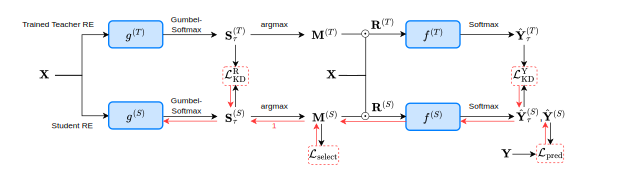

# Rationale Extraction with Knowledge Distillation (REKD)

This repository contains the official code implementation for **Learn from A Rationalist: Distilling Intermediate Interpretable Rationales** to appear on ICML 2026. 

*(Note: Reference and specific paper details will be added when the paper gets published online.)*

## 📑 Table of Contents
- [Overview](#overview)
- [Repository Structure](#repository-structure)
- [Installation](#installation)
- [Data and Model Preparation](#data-model-preparation)
- [Usage](#usage)
  - [Training and Testing](#training-and-testing)
  - [Rationales](#rationales)
- [Citation](#citation)
- [License](#license)

<a id="overview"></a>
## 📖 Overview
*In the select-predict architecture of rationale extraction (RE), the generator relies on the guidance of the predictor to select important features (i.e., a rationale) while the predictor relies on the output of the generator to learn task prediction. This "chicken-and-egg" dilemma is significantly exacerbated when the base neural networks are not sufficiently capable.* 

*To mitigate this, we propose a knowledge distillation method REKD for Gumbel-Softmax based RE models where a student models learns from the rationales and the predictions of a teacher RE model in addition to its own RE exploration. Our approach provides a neural-model agnostic distillation framework that leverages the intrinsic curriculum of the Gumbel-Softmax annealing.*

<figure align="center">
  
  <figcaption><b>Figure:</b> Architecture Schematic of REKD. </figcaption>
</figure>

<a id="repository-structure"></a>
## 🗂 Repository Structure
The repository is organized as follows:

```text
REKD/
├── ablation_scripts/   # Bash scripts to run ablation studies
├── data/               # Directory containing datasets and data processing scripts
├── nns/                # Neural network modules and model architectures
├── results/            # Output directory for saving evaluation results
├── run/                # Execution scripts for training and testing
├── saved/              # Directory for saving model checkpoints
├── scripts/            # Bash scripts for running main experiments
├── utils/              # Helper functions, metrics, and utility scripts
├── requirements.txt    # Python dependencies required to run the project
└── README.md           # This documentation file
```

<a id="installation"></a>
## ⚙️ Installation
Follow these steps to set up the environment and install the required dependencies for REKD.

**Prerequisite:** python=3.11.5; cuda=12.6

**Clone the repository and install dependencies**

```bash
git clone https://github.com/JiayiDai/REKD.git
pip install -r requirements.txt
```

<a id="data-model-preparation"></a>
## 📊 Data and Model Preparation
The REKD framework is validated on both language and vision tasks. Please prepare the datasets before running the experiments. We have included the following datasets and backbone neural models:

Datasets: `IMDB movie reviews`, `CIFAR10` and `CIFAR100`.

Language models: `bert-base-uncased`, `bert-small`, `bert-mini` for language.

Vision models: `vit-base-patch16-224`, `vit-small-patch16-224`, `vit-tiny-patch16-224`.

More datasets could be added in `data/retrieve_data_balanced.py`.

More neural models could be added in `nns/`.

<a id="usage"></a>
## 🚀 Usage

### Training and Testing
To train and test the models, execute the provided bash scripts in the `scripts/` directory. 

You can specify the dataset and backbone neural model (e.g., BERT for language, ViT for vision) within the scripts.

```bash
# We have included the following scripts
# With teacher=bert-base-uncased; student=bert-small; seed=2026; dataset=IMDB
# Note that teacher rationale extraction has to be done before knowledge distillation

# Example for classification (CLS)
bash scripts/bert_base_cls/bert_cls.sh 2026
bash scripts/bert_small_cls/small_cls.sh 2026

# Example for rationale extraction (RE)
bash scripts/bert_base_re/bert_re.sh 2026
bash scripts/bert_small_re/small_re.sh 2026

# Example for rationale extraction with knowledge distillation (REKD)
# The teacher model path is specified in the script
bash scripts/bert_small_kd/small_kd.sh 2026
```

The trained models will be saved in `saved/` folder.
The testing results will appear in `results/` folder.

### Rationales
Given a RE or REKD model, you may output the rationales with the following script. 

```bash
# Example for BERT on IMDB
bash scripts/run_rationales/run_inference.sh
```

See `scripts/run_rationales/` folder for more scripts.

<a id="citation"></a>
## 📝 Citation

If you find this code or our paper useful in your research, please cite our work:

```bibtex
@inproceedings{dai2026rekd,
  title={Learn from A Rationalist: Distilling Intermediate Interpretable Rationales},
  author={Dai, Jiayi and Goebel, Randy},
  booktitle={Proceedings of the 43rd International Conference on Machine Learning},
  year={2026},
  note={To appear}
}
```

<a id="license"></a>
## 📄 License

This project is licensed under the MIT License - see the [LICENSE](LICENSE) file for details.
